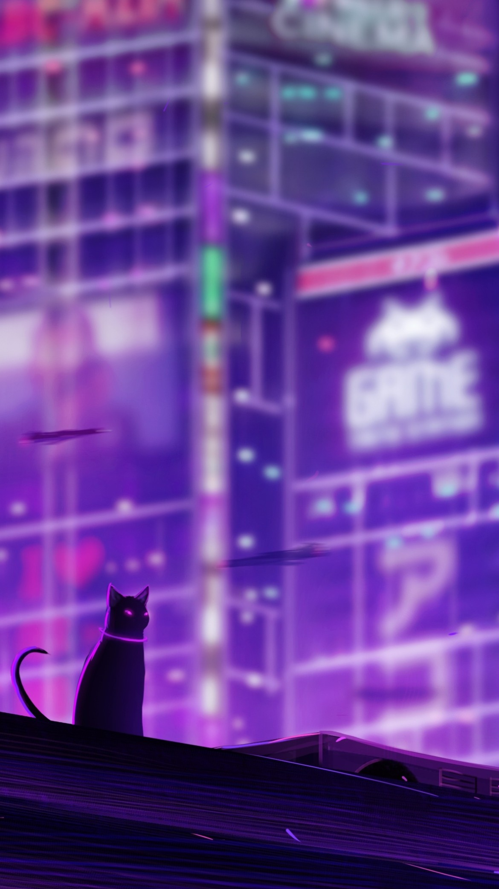
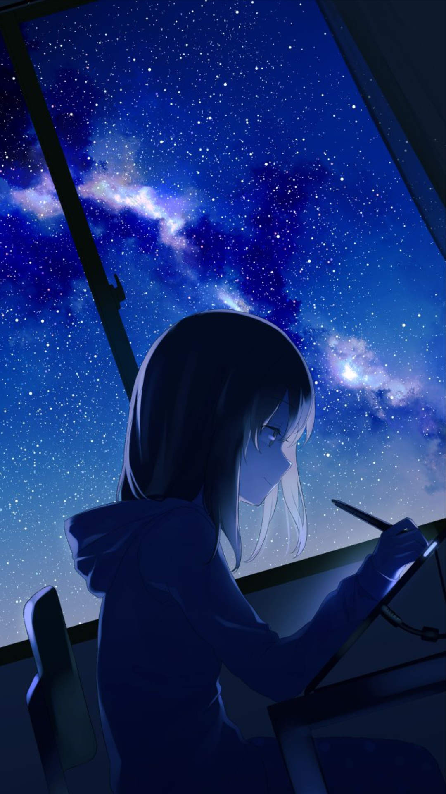

<!-- ========================= HEADER ========================= -->

---

<table>
<tr>

<td width="65%" valign="top">

> ### Software Engineer with a passion for Game Development and Graphics Programming.

I enjoy building software that solves real problems—from web applications and developer tools to rendering engines and games. I'm always exploring new technologies and pushing myself to learn something new.

> ### 🚀 Currently

- 🔭 Building **Lazap**
- 🌱 Learning **Flutter**, **Graphics Programming**, and advancing my **Full-Stack Development** skills
- 🐧 Daily driving **Fedora Linux**
- 💡 Interested in Rendering, Linux, Developer Tools, and Game Development

---

## 🛠 Tech Stack

> ### Languages

> ### Frontend

> ### Backend

> ### Database

> ### Tools & Platforms

---

> ### 📫 Connect

</td>

<td width="35%" align="center">

---

  

> ### Currently Exploring

🎨 Graphics Programming

📱 Flutter

⚡ C++

🌐 Full-Stack Development

</td>

</tr>
</table>

---

<i>Building software, learning continuously, and enjoying the journey.</i>

<!-- ========================= FOOTER ========================= -->

